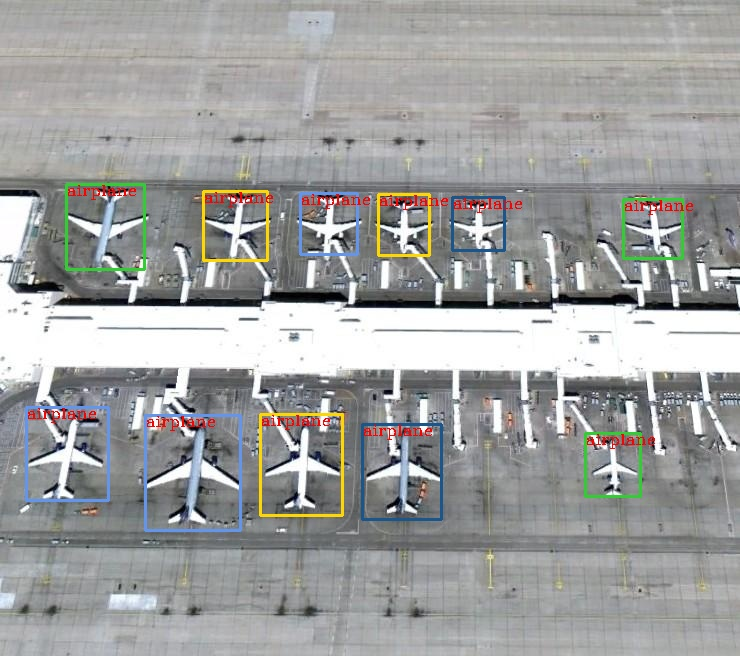
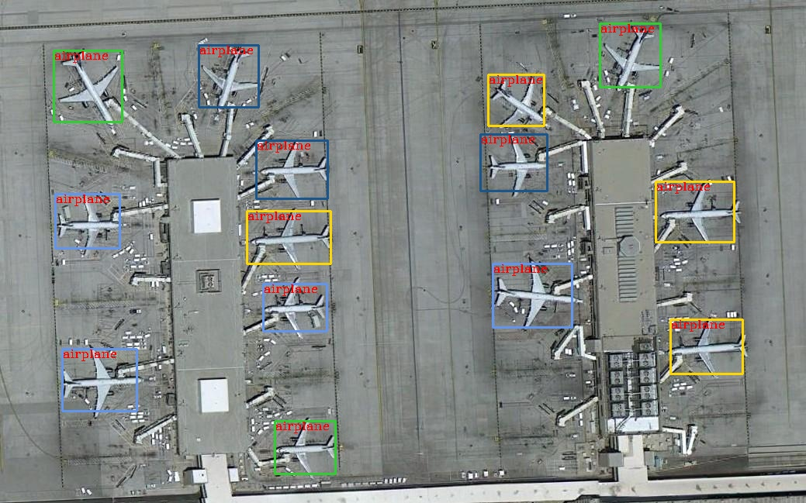

# Atlas_200DK_yolov3_tf_cpp

# Notes
Because [the official code](https://gitee.com/ascend/samples) gives the yolov3 model trained by caffe.To facilitate the training of my own datasets, I will use the tenforflow version of the yolov3 model trained by this [repository](https://github.com/YunYang1994/tensorflow-yolov3). I modified the official code to deploy the OM Model transfered from tensorflow model using cpp. At the same time, you can get the time spent in preprocessing, model inference, post-processing.

# Environments 
- C73

# Visualization
some results you can see in 'out/ouput'

